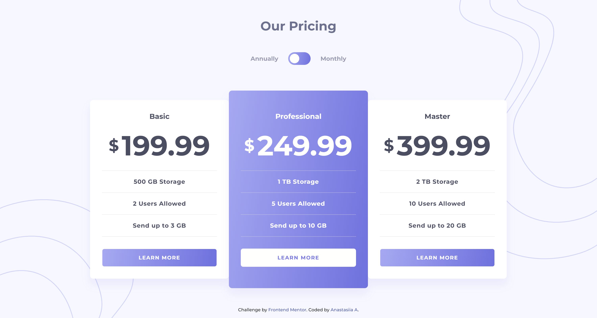

# Pricing component with toggle solution

This is my solution to the [Pricing component with toggle challenge on Frontend Mentor](https://www.frontendmentor.io/challenges/pricing-component-with-toggle-8vPwRMIC).  

## Table of contents

- [Overview](#overview)
  - [The challenge](#the-challenge)
  - [Screenshot](#screenshot)
  - [Links](#links)
- [My process](#my-process)
  - [Built with](#built-with)
  - [What I learned](#what-i-learned)
- [Thanks](#thanks-for-your-visit)

## Overview

### The challenge

Users should be able to:

- View the optimal layout for the component depending on their device's screen size
- Control the toggle with both their mouse/trackpad and their keyboard

### Screenshot

Here is the result of my code:



### Links

- Live Site URL: [Coming soon..](https://your-live-site-url.com)
- Solution code URL: [This GitHub repo](https://github.com/anastasiiaal/pricing-component-with-toggle)

## My process

### Built with

- Semantic HTML5 markup
- CSS (Flexbox, CSS Grid, etc.)
- [Sassy CSS](https://sass-lang.com/)
- NPM 
- [React](https://reactjs.org/) JS library
- [Vite.js](https://vitejs.dev/)

### What I learned

This project's main goal was to practice React.js framework.
To make this whole thing work, I had to learn about React components, about the concept of state and other things that used to be new to me.

Having my index.html file look like that:
```html
<body>
  <div id="root"></div>
  <script type="module" src="/src/index.jsx"></script>
</body>
```
was quite unusual and exciting.

Making these lines 
```js
function App() {
  return (
    <main>
      <BgWaves />
      <Main />
      <Attribution />
    </main>
  )
}
```
generate the whole page content was thrilling!

## Thanks for your visit! ✨